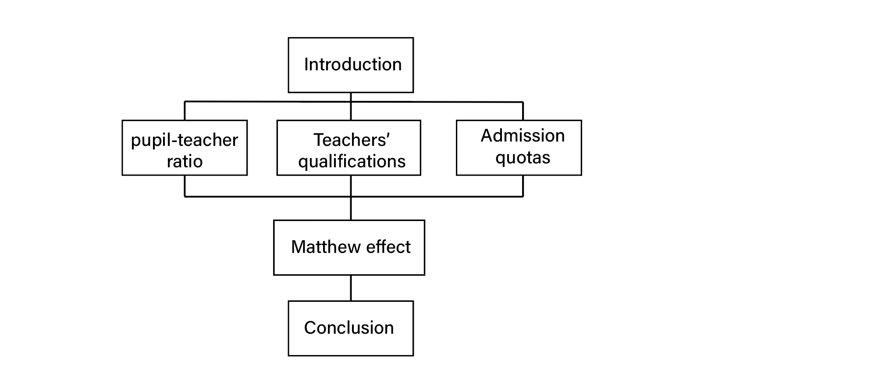

# Geographical Inequality in Chinese Education
**Team Members:** Liujing Ren, Zijing Lu, Ziyu Han, Chengyu Chen

**Summary Image:**

**Abstract:**

The enlarging educational gap is enlarging but received poor attention from the public and media. Society has not reached a coordinated effort to tackle the issue. This paper is about a design demonstrating the problems of educational inequality such as geographical educational inequality, college admission quotas distribution, and educational Mathew effect by storytelling. The paper contributes to the discussions of educational inequality and may trigger some social impact.

**Link to paper:**

[https://docs.google.com/document/d/1QLk5chaXRa5tqX8g6jSK57MtpA5t0zpX43zNwtqBLgM/edit?usp=sharing](https://docs.google.com/document/d/1QLk5chaXRa5tqX8g6jSK57MtpA5t0zpX43zNwtqBLgM/edit?usp=sharing)

**Link to video:**

 [https://drive.google.com/file/d/1Vj1_FoIUIrI8zvFMQfIy35aMBTeHk92L/view?usp=sharing](https://drive.google.com/file/d/1Vj1_FoIUIrI8zvFMQfIy35aMBTeHk92L/view?usp=sharing)

**Link to the narrative visualization:**

[https://observablehq.com/@edvocator/geographical-inequality-in-chinese-education](https://observablehq.com/@edvocator/geographical-inequality-in-chinese-education)

**Break down of work:**

After setting the principles of design and the storyline in the meeting, each of the team members was responsible for a certain part of the storytelling. By dividing the main character's educational experiences into four different stages, each member focused on one issue to address.

Chengyu Chen

* The Pupil-Teacher Ratio of junior schools in different provinces in China 
Zijing Lu

* The Ratio of the teachers with graduate degrees in different provinces in China
*  Analyze the PISA data using LCA 
Liujing Ren

* Matthew Effect: The Over-centralization of Outstanding Students
* Drawing the images
Ziyu Han 

* The difficulty of getting into a good university in Henan
We also collaborated on the report:

Introduction - Liujing Ren

Related Work - Liujing Ren & Zijing Lu

Methods - Liujing Ren & Zijing Lu

Results - Liujing Ren

Discussion - Liujing Ren & Chenyu Chen

Future Work  - Ziyu Han

In terms of paper works, we always talked about the general ideas of different parts and everyone took each of them into deeper consideration. By meeting regularly, we are able to get familiar with each other's stories and communicate positively. The division of the work enables the team member to dig deeper into a specific topic and receive insights from others' exploration.

**Commentary**

In the beginning, we talked about the topic of our visualization by brainstorming. We reached different topics and chose "the equality of education" as our final topic. The main character's life is highly related to our educational background, which is why we found it intuitive and necessary. Our group always has a well-organized schedule according to the process, scheduling meetings and assigning works based on everyone's timeline. It turns out that we are finishing the project step by step, finally towards this well-organized result.

